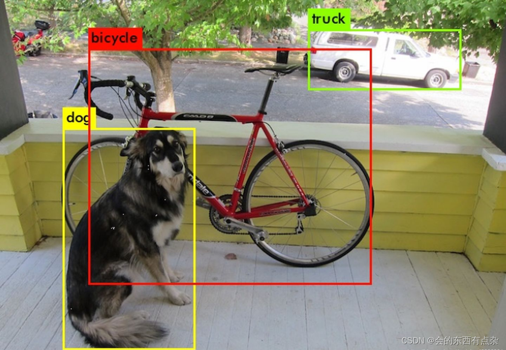

# 从训练到部署，NVIDIA Jetson Nano 实现 YOLOv8 目标检测

> 请在完成《基于 NVIDIA Jetson Nano 的视觉开发的几点教程》教程的学习和环境准备，再来阅读本教程

**在教程开始前，说一个非常重要的事，在教程里出现需要填写路径，请尽可能全部使用 Linux 风格的正斜杠（/），不要使用 Windows 风格的反斜杠（\），否则我不能保证不会出问题**

什么是目标检测？目标检测是计算机视觉中的一项基础任务，其核心目标是让计算机不仅能识别出图像或视频中存在的特定物体是“什么”（即分类），还能精确地定位出这些物体“在哪里”（即定位）。与仅给整张图片打上一个标签的图像分类不同，目标检测需要为图片中的每一个感兴趣物体都标定出一个通常用矩形框（Bounding Box）表示的位置，并同时给出该框内物体的类别标签。



YOLO 是一种轻量级，速度快、准确率高的深度学习目标检测算法，YOLO 如此经典好用的一大原因是其极快的迭代速度，几乎是一年半载就更新一个大版本，主打一个与时俱进。而且，从YOLOv8开始，不再局限于目标检测领域，在图像分割、关键点检测等领域也在持续发力，这个教程里我们只讨论YOLOv8 目标检测的部分，其他部分除了数据采集标注方面有所不同，其他的也大差不差。

下面，我们就以 YOLOv8n 模型为例，开始我们的教程

## 0 为什么选择 YOLOv8n

如果使用官方的 Jetson Nano 系统镜像的话，自带的 Python 版本只能到 3.7，这个版本是无法安装运行 YOLOv8 的模型推理所需的 Ultralytics 库的，只能使用 archiconda 安装的 Python 3.8 才能安装。事实上以前 YOLOv5 是不需要安装 Ultralytics 库的，是可以直接通过官方的 Jetson Nano 系统镜像自带的 Python 3.7 来运行推理的。但是后来 YOLOv5 更新了之后也必须安装 Ultralytics，导致也没办法直接运行了。所以变成了运行 YOLOv5 也需要使用 archiconda 安装的 Python 3.8，YOLOv5 就变得没那么有优势了，反而不如 YOLOv8 效果好。

YOLO模型分为 n、s、m、l、x 五种规模的模型，规模依次从小到大，模型规模越大，模型复杂度越大、能应对的情况也可以越复杂，相对应的消耗显存和算力也越大，因为 Jetson Nano 性能有限，考虑到实际运用中时效性敏感，这里只用规模为 n 的模型。

## 1 数据采集阶段

首先，我们需要对需要识别的物品拍照，理想情况下是用实际运行目标检测的摄像头去拍照，当然没有条件的话，拿个参数差不多的摄像头甚至是手机调个参数模拟摄像头也是可以的。照片的数量每个类别需要至少200张（一张图片可以有多个类别），其实一个类别200张照片不算很多，甚至算小数据规模的训练，只不过我们可以通过数据增广的方式来扩充数据规模，我在这里才说每个类别需要至少200张。当然数据不嫌少，越多越好（前提建立在这是高质量数据的情况下）。

我们拍数据集的时候，要考虑各种各样的背景、角度、光照等因素对目标检测的影响，所以我们不要只呆在一个环境下对着目标物拍了几百张照片就交差，去比如实验室外面、楼道里，或者尝试开灯和关灯的情况，还要看看拍照出来后除了目标物以外的背景会不会太单一，多尝试不同的背景物，特别是容易和目标物混淆的背景。还要尝试不同角度下目标物的形变、光线变化、距离变化。总之，要多尝试收集你能想到的不同情况下的数据

采集数据的时候要注意，每个类别的数量要尽可能保持相等，或者数量不要相差太大，保证数据的均衡

模型数据量不足导致模型效果不好时，其实我们可以通过微调来优化模型，而无需整个模型重新训练，这一点我们后面再讨论

## 2 数据标注阶段（在自己的电脑上完成）

一般我们做 YOLO 目标检测的标注工作，用的是 LabelImg，下面就来说明 LabelImg 的安装

首先我们需要在 conda 上创建一个虚拟环境

```bash
conda create -n label python==3.8
```

虚拟环境名 label 可以自己取

需要注意的是，LabelImg 只支持 Python3.8

我们将虚拟环境切换到我们刚才创建的环境中

```bash
conda activate label
```

安装 LabelImg

```bash
pip install labelimg
```

安装完成后，我们在激活这个虚拟环境下直接在终端输入

```bash
lebelimg
```

就可以直接运行 LabelImg 了。注意 LabelImg 运行时，不要关闭我们打开 LabelImg 时打开的终端

点击 *Open Dir*


然后选择我们的数据集图片的目录


然后再点击 *Change Save Dir*


然后选择标注文件（用于记录标注出来的目标的位置和类别）的存放位置，这里建议和图片放在一起


然后我们点击菜单栏中的 *View*，勾选 *Auto Save Mode* 启用自动保存~~（你也不想辛辛苦苦打了几个小时的标忘记保存重新打吧）~~

如果只有一个类别的话，可以勾选 *Single Class Mode*，标注的时候会快一点


然后我们就可以~~快乐~~打标了

按键盘 w 键创建标注框，用鼠标拉出一个标注框（和用微信QQ截图的方法一样），按照需求输入标注框中的目标对应的类别（不要用中文），按键盘 d 键下一张图片，按键盘 a 键可以回到上一张图片


对标注框不满意的可以先用鼠标选中，拖动四个锚点来调整，也可以选中之后按下键盘 Delete 键删除（或鼠标右键选择删除） 

这里的类型注意要选 **PascalVOC **而不是选择 YOLO，虽然选择 YOLO 可以直接输出 YOLO 训练时需要的 txt 标注文件，但是当多个人分工做标注任务时，不同的人用 YOLO 格式输出的类别顺序是不一样的，可能导致数据类别是乱的，到时候训练出来的结果全是错的


**注意：数据标注的时候，我们框的时候一定要尽量紧密贴合目标物，不要多框也不要少框。当目标物被遮挡时，不要只框目标看得见的部分，看不见的部分也要框起来。标注的时候，不要因为目标小或者模糊而忽略，要全部框起来**

## 3 数据处理阶段（在自己的电脑上完成）

>如果想直接快捷的方法，可以直接看到本节最后部分，有一个将下文所有方法集大成者的一个脚本
>
>想要了解整个过程，或者不需要做那么多处理步骤，只想要完成其中一个步骤的，可以自行在本节中寻找

完成数据标注之后，我们会得到一个文件夹，包含了我们拍摄的图片，还有与图片同名的 xml 标注文件（这个时候不要重命名其中任何一个文件，训练的时候图片和标注文件就是通过相同的文件名一一对应的，改了没对应上训练出来也是错的）

首先我们需要将 PascalVOC 的 xml 格式标注文件转换成 YOLO 用的 txt 格式标注文件才能训练，转换的脚本可以自行 AI，也可以使用本教程提供的配套文件中的脚本 `xml_to_txt.py` **（如果你选择使用 AI 或者自行寻找或编写转换程序的话，建议除了转换 xml 为 txt 外，还要生成 classses.txt 这个文件，不然只有 txt 标注文件，你和训练环境是认不出类别的，具体到本教程第四节你就知道为什么了）**

```python
"""
XML转YOLO格式标注脚本
自动从XML文件提取类别并生成classes.txt
需要安装依赖：pip install tqdm
"""

import os
import xml.etree.ElementTree as ET
from tqdm import tqdm
import argparse


def extract_classes_from_xml(xml_dir):
    """从XML文件中提取所有类别"""
    classes_set = set()
    xml_files = [f for f in os.listdir(xml_dir) if f.endswith('.xml')]
    
    for xml_file in tqdm(xml_files, desc="提取类别"):
        try:
            tree = ET.parse(os.path.join(xml_dir, xml_file))
            root = tree.getroot()
            
            for obj in root.iter('object'):
                cls_name = obj.find('name').text.strip()
                classes_set.add(cls_name)
        except Exception as e:
            print(f"\n解析 {xml_file} 失败：{str(e)}")
            continue
    
    # 将类别转换为有序列表
    classes_list = sorted(list(classes_set))
    classes_dict = {name: idx for idx, name in enumerate(classes_list)}
    return classes_dict


def xml_to_yolo(xml_path, classes_dict, output_dir):
    """转换单个XML文件为YOLO格式"""
    try:
        tree = ET.parse(xml_path)
        root = tree.getroot()

        # 获取图像尺寸
        size = root.find('size')
        width = int(size.find('width').text)
        height = int(size.find('height').text)

        if width <= 0 or height <= 0:
            raise ValueError(f"无效的尺寸：{width}x{height}")

        # 创建输出文件
        txt_file = os.path.basename(xml_path).replace('.xml', '.txt')
        txt_path = os.path.join(output_dir, txt_file)

        with open(txt_path, 'w') as f:
            for obj in root.iter('object'):
                # 获取类别
                cls_name = obj.find('name').text.strip()
                if cls_name not in classes_dict:
                    # 如果遇到新类别，动态添加到字典（虽然不太可能发生）
                    new_id = len(classes_dict)
                    classes_dict[cls_name] = new_id
                    print(f"警告：发现新类别 '{cls_name}'，已分配ID {new_id}")
                
                cls_id = classes_dict[cls_name]

                # 获取边界框
                bndbox = obj.find('bndbox')
                xmin = float(bndbox.find('xmin').text)
                ymin = float(bndbox.find('ymin').text)
                xmax = float(bndbox.find('xmax').text)
                ymax = float(bndbox.find('ymax').text)

                # 转换为YOLO格式
                x_center = (xmin + xmax) / 2 / width
                y_center = (ymin + ymax) / 2 / height
                w = (xmax - xmin) / width
                h = (ymax - ymin) / height

                # 验证归一化值
                if not (0 <= x_center <= 1 and 0 <= y_center <= 1 and 0 <= w <= 1 and 0 <= h <= 1):
                    raise ValueError(f"非法坐标值：{x_center:.4f} {y_center:.4f} {w:.4f} {h:.4f}")

                f.write(f"{cls_id} {x_center:.6f} {y_center:.6f} {w:.6f} {h:.6f}\n")

        return True
    except Exception as e:
        print(f"\n处理 {os.path.basename(xml_path)} 失败：{str(e)}")
        return False


def save_classes_file(classes_dict, output_dir):
    """保存类别文件"""
    classes_path = os.path.join(output_dir, 'classes.txt')
    with open(classes_path, 'w') as f:
        for cls_name, cls_id in sorted(classes_dict.items(), key=lambda x: x[1]):
            f.write(f"{cls_name}\n")
    return classes_path


def batch_convert(input_dir, output_dir):
    """批量转换主函数"""
    os.makedirs(output_dir, exist_ok=True)

    # 从XML文件中提取类别
    print("正在从XML文件中提取类别...")
    classes_dict = extract_classes_from_xml(input_dir)
    
    if not classes_dict:
        print("错误：未找到任何有效的类别")
        return False
    
    print(f"发现 {len(classes_dict)} 个类别：{list(classes_dict.keys())}")
    
    # 保存类别文件
    classes_path = save_classes_file(classes_dict, output_dir)
    print(f"类别文件已保存：{classes_path}")

    # 获取所有XML文件
    xml_files = [f for f in os.listdir(input_dir) if f.endswith('.xml')]

    # 处理进度条
    success = 0
    pbar = tqdm(xml_files, desc="转换进度")
    for xml_file in pbar:
        xml_path = os.path.join(input_dir, xml_file)
        if xml_to_yolo(xml_path, classes_dict, output_dir):
            success += 1
        pbar.set_postfix({"成功率": f"{success}/{len(xml_files)}"})
    
    return success == len(xml_files)


if __name__ == "__main__":
    parser = argparse.ArgumentParser(description="XML转YOLO标注工具（自动提取类别）")
    parser.add_argument("-i", "--input", required=True, help="包含XML文件的输入目录")
    parser.add_argument("-o", "--output", required=True, help="输出TXT文件目录")

    args = parser.parse_args()

    # 参数验证
    if not os.path.isdir(args.input):
        print(f"错误：输入目录 {args.input} 不存在")
        exit(1)

    print(f"输入目录: {os.path.abspath(args.input)}")
    print(f"输出目录: {os.path.abspath(args.output)}")

    # 执行转换
    if batch_convert(args.input, args.output):
        print("\n✅ 转换完成！请检查输出目录")
    else:
        print("\n❌ 转换过程中出现错误")
        exit(1)
```

使用方法：

运行终端，先激活任意一个 conda 虚拟环境，安装依赖

```bash
pip install tqdm
```

然后切换工作目录到脚本所在文件夹，运行以下命令

```bash
python xml_to_txt.py --input /path/to/input --output /path/to/output
```

参数解释：

* input：输入路径，也就是你 xml 标注文件的所在目录
* output：输出路径，YOLO 格式的 txt 标注文件保存位置，建议和输入路径相同

---

假如我们的数据集样本量比较少，或者我们想让模型有更强的健壮性，我们可以对数据进行数据增广

数据增广就是用数字图像的处理方法，来模拟各种恶劣情形，从而来增加数据量

常见的数据增广方法有颜色抖动、随机噪声、随机旋转等

这里给出颜色抖动、随机噪声的脚本 `color.py` 和 `noise.py`

color.py:

```python
import os
import random
import math
import argparse
import shutil
from PIL import Image, ImageEnhance
from tqdm import tqdm

# ------------------- 核心功能函数 -------------------
def apply_color_jitter(image,
                      brightness_range=(0.8, 1.2),
                      contrast_range=(0.8, 1.2),
                      saturation_range=(0.8, 1.2),
                      hue_range=(-0.1, 0.1)):
    """应用颜色抖动增强"""
    # 处理Alpha通道
    has_alpha = image.mode == 'RGBA'
    if has_alpha:
        alpha = image.split()[3]
        image = image.convert('RGB')

    # 生成随机参数
    brightness = random.uniform(*brightness_range)
    contrast = random.uniform(*contrast_range)
    saturation = random.uniform(*saturation_range)
    hue = random.uniform(*hue_range)

    # 应用颜色变换
    enhancer = ImageEnhance.Brightness(image)
    image = enhancer.enhance(brightness)

    enhancer = ImageEnhance.Contrast(image)
    image = enhancer.enhance(contrast)

    enhancer = ImageEnhance.Color(image)
    image = enhancer.enhance(saturation)

    # 色相调整（HSV空间）
    hsv_image = image.convert('HSV')
    h, s, v = hsv_image.split()
    h = h.point(lambda x: (x + int(hue * 255)) % 256)
    hsv_image = Image.merge('HSV', (h, s, v))
    image = hsv_image.convert('RGB')

    # 恢复Alpha通道
    if has_alpha:
        image.putalpha(alpha)

    return image

def copy_txt_file(source_txt, dest_dir, new_img_name):
    """复制并重命名TXT标注文件"""
    try:
        # 生成新TXT路径
        base_name = os.path.splitext(new_img_name)[0]
        dest_txt = os.path.join(dest_dir, f"{base_name}.txt")

        # 复制文件
        shutil.copy2(source_txt, dest_txt)
        return True
    except Exception as e:
        print(f"TXT处理失败: {str(e)}")
        return False

# ------------------- 处理流程函数 -------------------
def process_single_image(img_path, txt_path, output_dir,
                        suffix="_jitter",
                        brightness=(0.8,1.2),
                        contrast=(0.8,1.2),
                        saturation=(0.8,1.2),
                        hue=(-0.1,0.1)):
    """处理单个图像及其标注"""
    # 处理图像
    with Image.open(img_path) as img:
        jittered = apply_color_jitter(
            img,
            brightness_range=brightness,
            contrast_range=contrast,
            saturation_range=saturation,
            hue_range=hue
        )

        # 生成新文件名
        base = os.path.splitext(os.path.basename(img_path))[0]
        new_name = f"{base}{suffix}.png"
        output_path = os.path.join(output_dir, new_name)
        jittered.save(output_path, 'PNG')

    # 处理TXT
    if not copy_txt_file(txt_path, output_dir, new_name):
        os.remove(output_path)  # 删除无效输出
        return False

    return True

# ------------------- 批量处理函数 -------------------
def batch_process(input_dir, output_dir,
                 num_aug=3,
                 brightness=(0.8,1.2),
                 contrast=(0.8,1.2),
                 saturation=(0.8,1.2),
                 hue=(-0.1,0.1)):
    """批量处理主函数"""
    os.makedirs(output_dir, exist_ok=True)

    # 获取所有PNG文件
    images = [f for f in os.listdir(input_dir) if f.lower().endswith('.png')]

    # 进度条设置
    pbar = tqdm(images, desc="Processing", unit="img")

    for img_file in pbar:
        img_path = os.path.join(input_dir, img_file)
        txt_file = img_file.replace('.png', '.txt')
        txt_path = os.path.join(input_dir, txt_file)

        # 检查TXT是否存在
        if not os.path.exists(txt_path):
            tqdm.write(f"⚠️ 缺失标注文件：{txt_file}")
            continue

        # 生成多个增强版本
        success_count = 0
        for i in range(num_aug):
            try:
                result = process_single_image(
                    img_path=img_path,
                    txt_path=txt_path,
                    output_dir=output_dir,
                    suffix=f"_jitter{i+1}",
                    brightness=brightness,
                    contrast=contrast,
                    saturation=saturation,
                    hue=hue
                )
                if result:
                    success_count += 1
            except Exception as e:
                tqdm.write(f"❌ {img_file} 第{i+1}次增强失败: {str(e)}")

        pbar.set_postfix({"成功次数": success_count})

# ------------------- 主程序入口 -------------------
if __name__ == "__main__":
    parser = argparse.ArgumentParser(description="图像颜色抖动数据增广工具（YOLO TXT版）")
    parser.add_argument("-i", "--input", required=True, help="输入目录路径（包含PNG和TXT文件）")
    parser.add_argument("-o", "--output", required=True, help="输出目录路径")
    parser.add_argument("-n", "--num", type=int, default=3,
                      help="每张图片生成增强版本数量（默认：3）")
    parser.add_argument("-b", "--brightness", nargs=2, type=float, default=[0.8,1.2],
                      help="亮度调整范围（默认：0.8 1.2）")
    parser.add_argument("-c", "--contrast", nargs=2, type=float, default=[0.8,1.2],
                      help="对比度调整范围（默认：0.8 1.2）")
    parser.add_argument("-s", "--saturation", nargs=2, type=float, default=[0.8,1.2],
                      help="饱和度调整范围（默认：0.8 1.2）")
    parser.add_argument("-u", "--hue", nargs=2, type=float, default=[-0.1,0.1],
                      help="色相调整范围（默认：-0.1 0.1）")

    args = parser.parse_args()

    # 参数有效性检查
    if not os.path.isdir(args.input):
        print(f"错误：输入目录 {args.input} 不存在")
        exit(1)

    print("启动颜色抖动增广...")
    print(f"输入目录: {os.path.abspath(args.input)}")
    print(f"输出目录: {os.path.abspath(args.output)}")
    print(f"每张生成: {args.num} 个版本")
    print(f"亮度范围: {tuple(args.brightness)}")
    print(f"对比度范围: {tuple(args.contrast)}")
    print(f"饱和度范围: {tuple(args.saturation)}")
    print(f"色相范围: {tuple(args.hue)}")

    batch_process(
        input_dir=args.input,
        output_dir=args.output,
        num_aug=args.num,
        brightness=tuple(args.brightness),
        contrast=tuple(args.contrast),
        saturation=tuple(args.saturation),
        hue=tuple(args.hue)
    )

    print("\n✅ 增广完成！输出结构示例：")
    print(f"增强图像: {os.path.join(args.output, 'example_jitter1.png')}")
    print(f"对应标注: {os.path.join(args.output, 'example_jitter1.txt')}")
```

**该脚本只支持 PNG 格式的图片**

使用方法：

运行终端，先激活任意一个 conda 虚拟环境，安装依赖

```bash
pip install tqdm Pillow
```

然后切换工作目录到脚本所在文件夹，运行以下命令

```bash
python color.py --input /path/to/input --output /path/to/output --num 3 --brightless 0.8 1.2 --contrast 0.8 1.2 --saturation 0.8 1.2 --hue -0.1 0.1
```

参数解释：

* input：输入目录，注意一定要是包含 **YOLO 的 txt 格式标注文件**的目录
* output：输出目录，颜色抖动后的图像和标注文件的存放位置，建议和输入目录相同
* num：颜色抖动生成的数据增广版本数量（默认：3）
* brightless：亮度抖动的范围（默认：0.8 1.2）
* contrast：对比度抖动范围（默认：0.8 1.2）
* saturation：饱和度抖动范围（默认：0.8 1.2）
* hue：色相抖动范围（默认：-0.1 0.1）

---

noise.py:

```python
import os
import argparse
import random
import numpy as np
from PIL import Image
from pathlib import Path
import shutil


def add_noise(image, noise_type='gaussian', intensity=0.05):
    """为图像添加不同类型的噪声"""
    img_array = np.array(image).astype(np.float32) / 255.0

    if noise_type == 'gaussian':
        noise = np.random.normal(0, intensity, img_array.shape)
    elif noise_type == 'salt_pepper':
        noise = np.zeros_like(img_array)
        prob = intensity
        # 椒盐噪声
        salt = np.random.rand(*img_array.shape[:2]) < prob / 2
        pepper = np.random.rand(*img_array.shape[:2]) < prob / 2
        noise[salt] = 1.0
        noise[pepper] = -1.0
    elif noise_type == 'speckle':
        noise = img_array * np.random.randn(*img_array.shape) * intensity
    else:
        raise ValueError(f"未知噪声类型: {noise_type}")

    # 应用噪声并限制数值范围
    noisy_array = np.clip(img_array + noise, 0, 1)
    return Image.fromarray((noisy_array * 255).astype(np.uint8))


def copy_txt_file(txt_path, output_dir, new_img_name):
    """复制并重命名TXT标注文件"""
    try:
        # 生成新TXT文件名
        new_txt_name = Path(new_img_name).with_suffix('.txt')
        dest_txt = output_dir / new_txt_name

        # 复制文件
        shutil.copy2(txt_path, dest_txt)
        return True
    except Exception as e:
        print(f"TXT处理失败: {str(e)}")
        return False


def process_image(img_path, txt_path, output_dir, noise_config):
    """处理单个图像和对应TXT"""
    try:
        # 生成新文件名
        suffix = f"_{noise_config['type']}" if not noise_config['random'] else ""
        new_name = f"{img_path.stem}_aug{suffix}{img_path.suffix}"
        new_img_path = output_dir / new_name

        # 添加噪声
        with Image.open(img_path) as img:
            # 随机选择噪声类型
            if noise_config['random']:
                noise_type = random.choice(noise_config['types'])
            else:
                noise_type = noise_config['type']

            noisy_img = add_noise(img,
                                  noise_type=noise_type,
                                  intensity=noise_config['intensity'])
            noisy_img.save(new_img_path)

        # 处理TXT
        if not copy_txt_file(txt_path, output_dir, new_name):
            os.remove(new_img_path)  # 删除无效图片
            return False

        print(f"处理成功: {img_path.name} -> {new_name}")
        return True
    except Exception as e:
        print(f"处理失败: {img_path.name} - {str(e)}")
        return False


def main():
    parser = argparse.ArgumentParser(description='YOLO数据增强工具 - 添加随机噪声')
    parser.add_argument('input_dir', type=str, help='输入目录路径（包含PNG和TXT文件）')
    parser.add_argument('-o', '--output', type=str, default='aug_output',
                        help='输出目录路径 (默认: aug_output)')
    parser.add_argument('-r', '--recursive', action='store_true',
                        help='递归处理子目录')
    parser.add_argument('-t', '--noise-type', type=str, default='random',
                        choices=['gaussian', 'salt_pepper', 'speckle', 'random'],
                        help='噪声类型选择 (默认: 随机选择)')
    parser.add_argument('-i', '--intensity', type=float, default=0.05,
                        help='噪声强度 (默认: 0.05)')
    args = parser.parse_args()

    # 配置噪声参数
    noise_config = {
        'random': args.noise_type == 'random',
        'type': args.noise_type,
        'types': ['gaussian', 'salt_pepper', 'speckle'],
        'intensity': args.intensity
    }

    # 创建输出目录
    input_dir = Path(args.input_dir)
    output_dir = Path(args.output)
    output_dir.mkdir(parents=True, exist_ok=True)

    # 收集文件
    file_pairs = []
    search_pattern = '**/*' if args.recursive else '*'

    for img_path in input_dir.glob(f'{search_pattern}.png'):
        txt_path = img_path.with_suffix('.txt')
        if txt_path.exists():
            file_pairs.append((img_path, txt_path))
        else:
            print(f"警告：缺失标注文件 {txt_path.name}")

    print(f"找到 {len(file_pairs)} 对图片-TXT文件")

    # 处理文件
    success_count = 0
    for img_path, txt_path in file_pairs:
        if process_image(img_path, txt_path, output_dir, noise_config):
            success_count += 1

    print(f"\n处理完成！成功: {success_count}/{len(file_pairs)}")
    print(f"输出目录结构示例：")
    print(f"增强图片: {output_dir / 'image_aug.png'}")
    print(f"对应标注: {output_dir / 'image_aug.txt'}")


if __name__ == '__main__':
    main()
```

**该脚本只支持 PNG 格式的图片**

使用方法：

运行终端，先激活任意一个 conda 虚拟环境，安装依赖

```bash
pip install Pillow
```

然后切换工作目录到脚本所在文件夹，运行以下命令

```bash
python noise.py /path/to/input --output /path/to/output --recursive --noise-type gaussian --intensity 0.1
```

参数解释：

* 默认参数直接填写输入路径，注意一定要是包含 **YOLO 的 txt 格式标注文件**的目录
* output：输出目录，随机噪声后的图像和标注文件的存放位置，建议和输入目录相同
* recursive：递归目录，输入目录下有子文件夹的情况下应启用
* noise type：噪声类型，有高斯噪声（gaussian）、椒盐噪声（salt_pepper）、散斑噪声（speckle）、三者随机（random）（默认: 随机选择）
* intensity：噪声强度（默认: 0.05）

---

我们还需要对数据集进行一个处理，那就是分割数据集，将数据分割为训练集和验证集（YOLO 训练过程中测试集是可选的，但必须有验证集）

现在给出数据集分割的脚本`data_segment.py`（运行该脚本前，请确认你的数据集是只有一个文件夹，文件夹中包含 png 图像和 txt 标注文件）

```python
import os
import random
import shutil
import argparse
from tqdm import tqdm

def split_dataset(input_dir, output_dir, train_ratio=0.8, seed=None):
    """
    参数：
        input_dir: 包含PNG和TXT的输入目录
        output_dir: 输出根目录
        train_ratio: 训练集比例 (0.0-1.0)
        seed: 随机种子 (默认None)
    """
    # 设置随机种子
    if seed is not None:
        random.seed(seed)

    # 创建YOLO标准目录结构
    train_dir = os.path.join(output_dir, "train")
    val_dir = os.path.join(output_dir, "val")

    for d in [train_dir, val_dir]:
        os.makedirs(d, exist_ok=True)

    # 获取所有有效文件对
    file_pairs = []
    for f in os.listdir(input_dir):
        if f.lower().endswith('.png'):
            txt_file = f[:-4] + '.txt'
            txt_path = os.path.join(input_dir, txt_file)
            if os.path.exists(txt_path):
                file_pairs.append((f, txt_file))
            else:
                print(f"警告：缺失标注文件 {txt_file}，跳过 {f}")

    # 随机打乱文件对
    random.shuffle(file_pairs)

    # 计算分割点
    split_idx = int(len(file_pairs) * train_ratio)
    train_files = file_pairs[:split_idx]
    val_files = file_pairs[split_idx:]

    # 复制训练集文件
    print(f"\n正在复制训练集 ({len(train_files)} 个样本)...")
    for img_file, txt_file in tqdm(train_files, desc="训练集"):
        # 复制图片
        shutil.copy2(os.path.join(input_dir, img_file),
                    os.path.join(train_dir, img_file))
        # 复制标签
        shutil.copy2(os.path.join(input_dir, txt_file),
                    os.path.join(train_dir, txt_file))

    # 复制验证集文件
    print(f"\n正在复制验证集 ({len(val_files)} 个样本)...")
    for img_file, txt_file in tqdm(val_files, desc="验证集"):
        # 复制图片
        shutil.copy2(os.path.join(input_dir, img_file),
                    os.path.join(val_dir, img_file))
        # 复制标签
        shutil.copy2(os.path.join(input_dir, txt_file),
                    os.path.join(val_dir, txt_file))

    # 打印统计信息
    print("\n" + "=" * 50)
    print(f"总样本数: {len(file_pairs)}")
    print(f"训练集数量: {len(train_files)} ({len(train_files)/len(file_pairs):.1%})")
    print(f"验证集数量: {len(val_files)} ({len(val_files)/len(file_pairs):.1%})")
    print("输出目录结构：")
    print(f"📁 {output_dir}")
    print(f"├── 📁 train (共 {len(train_files)} 对文件)")
    print(f"│   ├── image1.png")
    print(f"│   ├── image1.txt")
    print(f"│   └── ...")
    print(f"└── 📁 val (共 {len(val_files)} 对文件)")
    print(f"    ├── image2.png")
    print(f"    └── image2.txt")
    print("=" * 50)

if __name__ == "__main__":
    parser = argparse.ArgumentParser(description="YOLO数据集分割工具")
    parser.add_argument("-i", "--input", required=True,
                      help="输入目录路径（包含PNG和TXT文件）")
    parser.add_argument("-o", "--output", required=True,
                      help="输出根目录路径")
    parser.add_argument("-r", "--ratio", type=float, default=0.8,
                      help="训练集比例（默认0.8）")
    parser.add_argument("-s", "--seed", type=int, default=None,
                      help="随机种子（默认None）")

    args = parser.parse_args()

    # 参数验证
    if not 0 < args.ratio < 1:
        print("错误：分割比例必须在0到1之间")
        exit(1)

    if not os.path.isdir(args.input):
        print(f"错误：输入目录 {args.input} 不存在")
        exit(1)

    print(f"🔍 输入目录: {os.path.abspath(args.input)}")
    print(f"💾 输出目录: {os.path.abspath(args.output)}")
    print(f"📊 分割比例: 训练集 {args.ratio:.0%} / 验证集 {1 - args.ratio:.0%}")
    print(f"🎲 随机种子: {args.seed or '未设置'}")

    split_dataset(
        input_dir=args.input,
        output_dir=args.output,
        train_ratio=args.ratio,
        seed=args.seed
    )

```

**该脚本只支持 PNG 格式的图片**

使用方法：

运行终端，先激活任意一个 conda 虚拟环境，安装依赖

```bash
pip install tqdm
```

然后切换工作目录到脚本所在文件夹，运行以下命令

```bash
python data_segment.py --input /path/to/input --output /path/to/output --ratio 0.8 --seed 47
```

参数解释

* input：输入目录
* output：输出目录，注意一定不能和输入路径相同
* ratio：分割比例（默认0.8）
* seed：随机种子

---

如果看上面脚本太多嫌麻烦，想要一步到位，可以使用下面给的脚本`all_in_one.py`

下面的脚本包含了 xml 标注转 txt 标注、转颜色抖动、随机噪声、数据集切分功能

```python
import os
import random
import shutil
import numpy as np
import xml.etree.ElementTree as ET
from PIL import Image, ImageEnhance, ImageOps
from tqdm import tqdm
import argparse
import tempfile

def parse_args():
    parser = argparse.ArgumentParser(description='YOLO Dataset Processing and Augmentation')
    parser.add_argument('--input_dir', type=str, required=True, help='Input directory with images and XML files')
    parser.add_argument('--output_dir', type=str, required=True, help='Output directory for processed dataset')
    parser.add_argument('--color_jitter_strength', type=float, default=0.2, help='Color jitter intensity (0.0 to 1.0)')
    parser.add_argument('--num_color_jitters', type=int, default=3, help='Number of color jitter augmentations per image')
    parser.add_argument('--gaussian_noise_std', type=float, default=15.0, help='Gaussian noise standard deviation')
    parser.add_argument('--split_ratio', type=float, default=0.8, help='Train/validation split ratio (0.0 to 1.0)')
    parser.add_argument('--seed', type=int, default=47, help='Random seed for reproducibility')
    return parser.parse_args()

def xml_to_yolo(xml_path, class_map):
    tree = ET.parse(xml_path)
    root = tree.getroot()
    
    size = root.find('size')
    width = int(size.find('width').text)
    height = int(size.find('height').text)
    
    yolo_lines = []
    for obj in root.findall('object'):
        cls_name = obj.find('name').text
        if cls_name not in class_map:
            class_map[cls_name] = len(class_map)
        cls_id = class_map[cls_name]
        
        bbox = obj.find('bndbox')
        xmin = float(bbox.find('xmin').text)
        ymin = float(bbox.find('ymin').text)
        xmax = float(bbox.find('xmax').text)
        ymax = float(bbox.find('ymax').text)
        
        # Convert to YOLO format (normalized center coordinates and dimensions)
        x_center = (xmin + xmax) / (2.0 * width)
        y_center = (ymin + ymax) / (2.0 * height)
        w = (xmax - xmin) / width
        h = (ymax - ymin) / height
        
        yolo_lines.append(f"{cls_id} {x_center:.6f} {y_center:.6f} {w:.6f} {h:.6f}")
    
    return "\n".join(yolo_lines)

def color_jitter(image, strength):
    """Apply random color jitter with given strength"""
    factors = [
        random.uniform(1 - strength, 1 + strength),  # Brightness
        random.uniform(1 - strength, 1 + strength),  # Contrast
        random.uniform(1 - strength, 1 + strength),  # Saturation
        random.uniform(-strength, strength)          # Hue
    ]
    
    # Brightness
    enhancer = ImageEnhance.Brightness(image)
    image = enhancer.enhance(factors[0])
    
    # Contrast
    enhancer = ImageEnhance.Contrast(image)
    image = enhancer.enhance(factors[1])
    
    # Saturation
    enhancer = ImageEnhance.Color(image)
    image = enhancer.enhance(factors[2])
    
    # Hue (using HSV conversion)
    hsv = np.array(image.convert('HSV'))
    hsv[..., 0] = (hsv[..., 0] + factors[3] * 255) % 255
    image = Image.fromarray(hsv, 'HSV').convert('RGB')
    
    return image

def add_gaussian_noise(image, std):
    """Add Gaussian noise to image"""
    img_array = np.array(image)
    noise = np.random.normal(0, std, img_array.shape)
    noisy_array = np.clip(img_array + noise, 0, 255).astype(np.uint8)
    return Image.fromarray(noisy_array)

def process_dataset(args):
    # Set random seeds
    random.seed(args.seed)
    np.random.seed(args.seed)
    
    # Create output directories
    os.makedirs(os.path.join(args.output_dir, 'train'), exist_ok=True)
    os.makedirs(os.path.join(args.output_dir, 'val'), exist_ok=True)
    
    # Create temporary directory
    temp_dir = tempfile.mkdtemp()
    print(f"Using temporary directory: {temp_dir}")
    
    try:
        # Collect all files
        all_files = [f for f in os.listdir(args.input_dir) if os.path.isfile(os.path.join(args.input_dir, f))]
        image_files = [f for f in all_files if f.lower().endswith(('.png', '.jpg', '.jpeg', '.bmp'))]
        xml_files = [f for f in all_files if f.lower().endswith('.xml')]
        
        # Create class mapping
        class_map = {}
        
        # Process each image to temporary directory
        all_data_files = []
        for img_file in tqdm(image_files, desc="Processing images"):
            base_name = os.path.splitext(img_file)[0]
            xml_file = f"{base_name}.xml"
            
            if xml_file not in xml_files:
                continue
            
            # Load image
            img_path = os.path.join(args.input_dir, img_file)
            image = Image.open(img_path).convert('RGB')
            
            # Convert XML to YOLO format
            xml_path = os.path.join(args.input_dir, xml_file)
            yolo_txt = xml_to_yolo(xml_path, class_map)
            
            # Save original image and YOLO txt to temp dir
            orig_img_path = os.path.join(temp_dir, f"{base_name}.jpg")
            image.save(orig_img_path)
            
            orig_txt_path = os.path.join(temp_dir, f"{base_name}.txt")
            with open(orig_txt_path, 'w') as f:
                f.write(yolo_txt)
            
            all_data_files.append((orig_img_path, orig_txt_path))
            
            # Color jitter augmentations
            for i in range(args.num_color_jitters):
                jittered = color_jitter(image.copy(), args.color_jitter_strength)
                jittered_img_path = os.path.join(temp_dir, f"{base_name}_color_{i}.jpg")
                jittered.save(jittered_img_path)
                
                jittered_txt_path = os.path.join(temp_dir, f"{base_name}_color_{i}.txt")
                with open(jittered_txt_path, 'w') as f:
                    f.write(yolo_txt)
                
                all_data_files.append((jittered_img_path, jittered_txt_path))
        
        # Add Gaussian noise to all images in temp dir
        noisy_files = []
        for img_path, txt_path in tqdm(all_data_files, desc="Adding noise"):
            base_name = os.path.splitext(os.path.basename(img_path))[0]
            image = Image.open(img_path)
            
            noisy_img = add_gaussian_noise(image, args.gaussian_noise_std)
            noisy_img_path = os.path.join(temp_dir, f"{base_name}_noise.jpg")
            noisy_img.save(noisy_img_path)
            
            noisy_txt_path = os.path.join(temp_dir, f"{base_name}_noise.txt")
            shutil.copy(txt_path, noisy_txt_path)
            
            noisy_files.append((noisy_img_path, noisy_txt_path))
        
        all_data_files.extend(noisy_files)
        
        # Split dataset
        random.shuffle(all_data_files)
        split_idx = int(len(all_data_files) * args.split_ratio)
        train_files = all_data_files[:split_idx]
        val_files = all_data_files[split_idx:]
        
        # Move training data to output directory
        for img_path, txt_path in tqdm(train_files, desc="Moving training data"):
            shutil.move(img_path, os.path.join(args.output_dir, 'train', os.path.basename(img_path)))
            shutil.move(txt_path, os.path.join(args.output_dir, 'train', os.path.basename(txt_path)))
        
        # Move validation data to output directory
        for img_path, txt_path in tqdm(val_files, desc="Moving validation data"):
            shutil.move(img_path, os.path.join(args.output_dir, 'val', os.path.basename(img_path)))
            shutil.move(txt_path, os.path.join(args.output_dir, 'val', os.path.basename(txt_path)))
        
        # Save class mapping
        with open(os.path.join(args.output_dir, 'classes.txt'), 'w') as f:
            for cls_name, cls_id in sorted(class_map.items(), key=lambda x: x[1]):
                f.write(f"{cls_name}\n")
        
        print(f"Dataset processing complete! Total images: {len(all_data_files)}")
        print(f"Training set: {len(train_files)} images")
        print(f"Validation set: {len(val_files)} images")
        print(f"Classes: {list(class_map.keys())}")
    
    finally:
        # Clean up temporary directory
        shutil.rmtree(temp_dir)
        print(f"Cleaned up temporary directory: {temp_dir}")

if __name__ == "__main__":
    args = parse_args()
    process_dataset(args)
```

**该脚本只支持 PNG、BMP、JPG、JPEG 图像文件**

使用方法：

运行终端，先激活任意一个 conda 虚拟环境，安装依赖

```bash
pip install numpy pillow tqdm
```

然后切换工作目录到脚本所在文件夹，运行以下命令

```bash
python all_in_one.py --input_dir /path/to/input --output_dir /path/to/output --color_jitter_strength 0.2 --num_color_jitters 3 --gaussian_noise_std 15 --split_ratio 0.8 --seed 47
```

参数解释：

* input_dir：输入目录
* output_dir：输出目录，注意一定不能和输入路径相同
* color_jitter_strength：颜色抖动振幅（默认：0.2）
* num_color_jitters：颜色抖动生成的版本数量（默认：3）
* gaussian_noise_std：高斯噪声的标准差（默认：15）
* split_ratio：数据集分割比例（默认：0.8）
* seed：随机种子

## 4 训练前准备阶段（在自己的电脑上完成）

首先，训练前，请先检查自己的电脑是否有 **NVIDIA 独立显卡**，没有的话是没办法运行训练的（其实 AMD 的独立显卡也可以训练，但是要求 Linux 平台，步骤麻烦，这里就不讲了）

首先，我们需要先去 [NVIDIA 官网](https://developer.nvidia.com/cuda-downloads)下载并安装 CUDA，才能够运行训练

安装完成后，我们打开 conda 终端，新建一个虚拟环境

```bash
conda create -n train python
```

然后我们切换到这个虚拟环境

```python
conda activate train
```

然后浏览器打开 [pytorch.org](https://pytorch.org)，点击 *Get started*


然后看到这个界面，复制这里的命令


这里的 CUDA 版本请根据你安装的 CUDA 版本来选择，CUDA 能够向下兼容，没有匹配的尽量选择同一个大版本的

将我们复制的命令粘贴到我们刚才的终端中运行，等待安装即可

这里千万不要直接`pip install pytorch`，这样下载的 pytorch 是 CPU 版本的，是没办法运行训练的，务必按照上面的方法安装

安装完成后，我们安装 Ultralytics

```bash
pip install ultralytics
```

这样，我们就配置好了 YOLO 的训练环境

---

我们现在先写一个数据集配置文件，用来告诉训练环境我们数据集的结构

首先我们创建一个文件夹，将数据集文件夹放在里面，再在这个文件夹中创建一个 yaml 文件 `dataset.yaml`，内容格式是这样

```yaml
path: ./dataset  # 不要使用反斜杠（\），要使用正斜杠（/），不然后面这个模型转换为TensorRT会报错
train: train
val: val

names:
  0: head
  1: helmet
  2: person
```

* path：填写你的数据集所在的路径
* train：填写训练集在**上面填写的 path 路径的相对路径**，比如你的训练集的路径是`/path/to/dataset/train`，你的 path 就是 `/path/to/dataset`，而你的train就应该填`train`
* val：与上面的 train 同理，填写验证集在**上面填写的 path 路径的相对路径**，比如你的验证集的路径是`/path/to/dataset/val`，你的 path 就是 `/path/to/dataset`，而你的train就应该填`val`
* names：这里填写你数据集中包含的类别，从0开始，**按照 classes.txt 中从上到下的顺序填写**

准备好 Ultralytics 官方预训练好的 `yolov8n.pt` 模型，可以自行去 [github 下载](https://github.com/ultralytics/assets/releases)，也可以在文档附带的文件中找到，放在和 yaml 文件和数据集文件夹所在的文件夹下

完成所有工作后，你的文件夹应该是长这样的（classes.txt 可以不用放进来）：


## 5 训练阶段（在自己的电脑上完成）

首先，我们先再次确认一下，我们现在打开的终端中，正处于安装了 pytorch 和 ultralytics 的虚拟环境中，只有安装了这两个库我们才能训练模型

在我们上面的目录下创建一个训练程序，下面是我们的训练程序`train.py`，详情解释请看代码注释

```python
from ultralytics import YOLO

model = YOLO("yolov8n.yaml")  # 这里不需要改，除非你运行的不是yolov8n
model.load("./yolov8n.pt")  # 预训练模型的路径，这里的意思是当前目录下

train_results = model.train(
    data="./dataset.yaml",  # yaml 数据集描述文件的路径，这里的意思是当前目录下，不要使用反斜杠（\），要使用正斜杠（/），不然后面这个模型转换为TensorRT会报错
    epochs=500,  # 训练的迭代次数
    imgsz=320,  # 输入的图像大小（对于Jetson Nano的算力而言，320是一个比较适中的，太大的话会无论是训练还是推理很消耗显存和算力，对于k210或者k230这种更小的计算平台，就要更小的输入图像大小，可能需要减少到224）
    device="0",  # 用于训练的设备，只有一块显卡填0就行
    batch=-1  # 批量大小，数值大一些训练会快一些，太大会爆显存崩溃，-1表示自动分配
)

# Evaluate the model's performance on the validation set
metrics = model.val()
```

> 关于输入的图像大小这一点我想多说几句，其实理论上来说，YOLO 当时在论文上写的是 640x640 的分辨率作为输入图像大小的，一般你来说我们的深度学习的每个层的输入是严格规定好的，我们不能随意更改。而 YOLO 姑且没有规定大小一定，但是规定了输入图像的分辨率必须是1:1，但是我们在采集数据或者实际应用，是很难保证输入的图像分辨率是1:1的。于是 YOLO 训练的时候会对图像进行缩放，跟据我们设定的图像大小，对于已经是1:1分辨率的图像，算法会将图像的边长缩放到目标大小，而对于分辨率不是1:1的图像，算法会先按比例缩放，将图像的长边先缩放到目标大小，这时候图像的短边长度就不够了，算法会将不够的部分用纯灰色填充，从而使得图像分辨率1:1，并且边长等于我们设定的大小
>
> 由此可知，对于近距离大目标而言，其实我们用很小的输入大小就可以实现很好的效果，而对于远距离小目标而言，缩放会损失掉很多细节信息，使得我们需要将输入图像大小调大，以减少缩放带来的影响

我们在终端中将工作目录切换到这个文件夹中

然后，在我们终端里输入下面的命令运行，训练就开始了

```bash
python train.py
```

过程中可能会下载 YOLOv11n 模型，没事，我们训练的还是 YOLOv8n

过程比较漫长，耐心等待，像我一般都是晚上睡觉前开始训练，等第二天早上再起来看结果（笑）

运行的时候就不要在终端界面乱按键盘了，一不小心按到 esc 或者是 Ctrl + C 会直接退出的，虽说也有补救措施，但你也不想搞得那么麻烦吧（笑）

这里的训练迭代次数假如填得比较大，你可能会发现实际运行的迭代次数有可能小于设定的迭代次数，因为 Ultralytics 在发现运行一段时间后模型效果没有太大优化就会自动停止，默认是 100 次迭代内没有优化自动停止，不用担心，正常使用即可

---

训练完成后，我们的文件夹下会多出一个 `runs` 文件夹，打开，里面有个 `detect` 文件夹，再打开，其中有 `train` 和 `train2` 两个文件夹，`train` 文件夹就是我们训练的结果，`train2` 文件夹则是我们最好的模型的测试结果（不包含模型）

我们打开 `train` 文件夹，再打开 `weights`  文件夹，我们会看到 `best.pt` 和 `last.pt` 两个权重文件文件（也就是模型），`best.pt` 是测试结果最好的模型，`last.pt` 则是最后一次迭代所生成的模型，一般来说，我们用 `best.pt` 就可以了

## 小插曲 1 训练中断了怎么办

如果真的很不幸，因为自己的一个手抖不小心停止了训练，又或者是停电，还是因为没调好 batch_size 导致训练程序爆显存崩溃，导致了训练的中止，我们还有补救方法，下面我就来讲解

首先打开我们保存数据集、训练程序、yaml 文件的文件夹，训练过程中会生成一个新的文件夹 `runs` ，我们打开，在其中的 `weights` 文件夹中找到 `last.pt` ，然后我们创建一个新的文件夹（防止 `runs` 文件夹模型放在一起混乱），将我们的数据集、训练程序、yaml 文件、还有 `last.pt` ，移动到新的文件夹中

修改我们的训练程序

```python
from ultralytics import YOLO

model = YOLO("yolov8n.yaml")
model.load("./last.pt")  # 这里填写我们刚才移动进来的last.pt文件

train_results = model.train(
    data="./dataset.yaml",  # 不要使用反斜杠（\），要使用正斜杠（/），不然后面这个模型转换为TensorRT会报错
    epochs=500,
    imgsz=320,
    device="0",
    batch=-1
)

metrics = model.val()
```

其实改动的地方就只有预训练模型的路径，让训练程序基于我们上一次训练最后一次迭代的位置继续训练

迭代次数可以跟据上次训练中断的位置灵活调整

然后我们还是打开终端，激活训练用的虚拟环境，运行下面命令

```bash
python train.py
```

训练就会继续下去了

## 小插曲 2 数据集增加了新数据，但是模型已经训练出来了，怎么做？

假使我们已经训练了模型，但是效果并不好，于是我们重新采集并标注了数据，我们需要将数据集合并之后重新从头开始训练吗？下面我就来说说怎么只训练新的数据，而无需从头开始

首先，我们必须强调，这一部分的 xml 转 txt 过程是不一样的，因为新的数据集的类别标号是要和原数据集保持一致的

首先找到我们原数据集的 classes.txt

下面是我们新的 xml 转 txt 的脚本：

```python
import os
import xml.etree.ElementTree as ET
from tqdm import tqdm
import argparse


def parse_classes(classes_file):
    """从文件读取类别列表"""
    with open(classes_file, 'r') as f:
        return {name.strip(): idx for idx, name in enumerate(f.readlines())}


def xml_to_yolo(xml_path, classes_dict, output_dir):
    """转换单个XML文件为YOLO格式"""
    try:
        tree = ET.parse(xml_path)
        root = tree.getroot()

        # 获取图像尺寸
        size = root.find('size')
        width = int(size.find('width').text)
        height = int(size.find('height').text)

        if width <= 0 or height <= 0:
            raise ValueError(f"无效的尺寸：{width}x{height}")

        # 创建输出文件
        txt_file = os.path.basename(xml_path).replace('.xml', '.txt')
        txt_path = os.path.join(output_dir, txt_file)

        with open(txt_path, 'w') as f:
            for obj in root.iter('object'):
                # 获取类别
                cls_name = obj.find('name').text.strip()
                if cls_name not in classes_dict:
                    raise KeyError(f"未定义的类别：{cls_name}")
                cls_id = classes_dict[cls_name]

                # 获取边界框
                bndbox = obj.find('bndbox')
                xmin = float(bndbox.find('xmin').text)
                ymin = float(bndbox.find('ymin').text)
                xmax = float(bndbox.find('xmax').text)
                ymax = float(bndbox.find('ymax').text)

                # 转换为YOLO格式
                x_center = (xmin + xmax) / 2 / width
                y_center = (ymin + ymax) / 2 / height
                w = (xmax - xmin) / width
                h = (ymax - ymin) / height

                # 验证归一化值
                if not (0 <= x_center <= 1 and 0 <= y_center <= 1 and 0 <= w <= 1 and 0 <= h <= 1):
                    raise ValueError(f"非法坐标值：{x_center:.4f} {y_center:.4f} {w:.4f} {h:.4f}")

                f.write(f"{cls_id} {x_center:.6f} {y_center:.6f} {w:.6f} {h:.6f}\n")

        return True
    except Exception as e:
        print(f"\n处理 {os.path.basename(xml_path)} 失败：{str(e)}")
        return False


def batch_convert(input_dir, output_dir, classes_dict):
    """批量转换主函数"""
    os.makedirs(output_dir, exist_ok=True)

    # 获取所有XML文件
    xml_files = [f for f in os.listdir(input_dir) if f.endswith('.xml')]

    # 处理进度条
    success = 0
    pbar = tqdm(xml_files, desc="转换进度")
    for xml_file in pbar:
        xml_path = os.path.join(input_dir, xml_file)
        if xml_to_yolo(xml_path, classes_dict, output_dir):
            success += 1
        pbar.set_postfix({"成功率": f"{success}/{len(xml_files)}"})


if __name__ == "__main__":
    parser = argparse.ArgumentParser(description="XML转YOLO标注工具")
    parser.add_argument("-i", "--input", required=True, help="包含XML文件的输入目录")
    parser.add_argument("-o", "--output", required=True, help="输出TXT文件目录")
    parser.add_argument("-c", "--classes", required=True, help="类别列表文件路径")

    args = parser.parse_args()

    # 参数验证
    if not os.path.isdir(args.input):
        print(f"错误：输入目录 {args.input} 不存在")
        exit(1)

    if not os.path.exists(args.classes):
        print(f"错误：类别文件 {args.classes} 不存在")
        exit(1)

    print(f"输入目录: {os.path.abspath(args.input)}")
    print(f"输出目录: {os.path.abspath(args.output)}")
    print(f"类别文件: {os.path.abspath(args.classes)}")

    # 加载类别映射
    try:
        classes = parse_classes(args.classes)
        print(f"加载到 {len(classes)} 个类别：{list(classes.keys())}")
    except Exception as e:
        print(f"加载类别失败：{str(e)}")
        exit(1)

    batch_convert(args.input, args.output, classes)
    print("\n✅ 转换完成！请检查输出目录")
```

使用方法：

运行终端，先激活任意一个 conda 虚拟环境，安装依赖

```bash
pip install tqdm
```

然后切换工作目录到脚本所在文件夹，运行以下命令

```bash
python xml_to_txt.py --input /path/to/input --output /path/to/output --classes classes.txt
```

参数解释：

* input：输入路径，也就是你 xml 标注文件的所在目录
* output：输出路径，YOLO 格式的 txt 标注文件保存位置，建议和输入路径相同
* classes：classes.txt 的路径

剩下的数据增广、数据集分割这里就不再赘述

然后我们找到原先训练出来的模型 `best.pt`

其实下面的过程与上一个说训练中断的教程差不多，首先我们新创建一个文件夹，其中放我们的新的数据集、模型 `best.pt`、训练程序、yaml 文件，yaml 文件一定要保持和原先的一样，然后我们修改训练程序

```python
from ultralytics import YOLO

model = YOLO("yolov8n.yaml")
model.load("./best.pt")  # 这里填写我们刚才移动进来的best.pt文件

train_results = model.train(
    data="./dataset.yaml",  # 不要使用反斜杠（\），要使用正斜杠（/），不然后面这个模型转换为TensorRT会报错
    epochs=500,
    imgsz=320,
    device="0",
    batch=-1
)

metrics = model.val()
```

然后我们打开终端，激活训练用的虚拟环境，运行下面命令

```bash
python train.py
```

## 6 部署阶段

### 6.1 直接运行

当我们拿到 `best.pt` 之后，我们其实就已经可以直接运行目标检测的推理了

下面是例程 `detect.py`：

```python
from ultralytics import YOLO
import cv2
import time

def run_camera_detection():
    # 1. 加载训练好的模型
    model = YOLO('best.pt')  # 替换为你的模型路径
    
    # 2. 打开摄像头
    cap = cv2.VideoCapture(0)  # 0 表示默认摄像头
    
    # 检查摄像头是否成功打开
    if not cap.isOpened():
        print("错误：无法打开摄像头")
        return
    
    print("摄像头已启动，开始检测...")
    print("按 'q' 键退出程序")
    
    # 用于计算FPS
    prev_time = 0
    
    try:
        while True:
            # 读取摄像头帧
            ret, frame = cap.read()
            if not ret:
                print("错误：无法读取摄像头帧")
                break
            
            # 3. 使用模型进行推理
            results = model(frame, conf=0.5)  # 设置置信度阈值
            
            # 4. 处理检测结果
            for r in results:
                # 获取检测框信息
                boxes = r.boxes
                
                if boxes is not None and len(boxes) > 0:
                    # 清空控制台显示（可选，使输出更清晰）
                    # print("\033[H\033[J")  # 清屏命令，根据需要取消注释
                    
                    print(f"\n检测到 {len(boxes)} 个目标:")
                    print("-" * 50)
                    
                    # 遍历每个检测框
                    for i, box in enumerate(boxes):
                        # 获取坐标（xyxy格式：左上角x,y + 右下角x,y）
                        xyxy = box.xyxy[0].cpu().numpy()
                        x1, y1, x2, y2 = xyxy.astype(int)
                        
                        # 获取置信度
                        conf = box.conf[0].cpu().numpy()
                        
                        # 获取类别ID和名称
                        cls_id = int(box.cls[0].cpu().numpy())
                        cls_name = model.names[cls_id]
                        
                        # 在控制台打印详细信息
                        print(f"目标 {i+1}: {cls_name} | "
                              f"坐标: [{x1}, {y1}, {x2}, {y2}] | "
                              f"置信度: {conf:.3f}")
                        
                        # 在图像上绘制检测框和标签
                        label = f"{cls_name} {conf:.2f}"
                        cv2.rectangle(frame, (x1, y1), (x2, y2), (0, 255, 0), 2)
                        cv2.putText(frame, label, (x1, y1 - 10), 
                                  cv2.FONT_HERSHEY_SIMPLEX, 0.5, (0, 255, 0), 2)
                
                else:
                    print("未检测到目标")
            
            # 计算并显示FPS
            current_time = time.time()
            fps = 1 / (current_time - prev_time) if prev_time > 0 else 0
            prev_time = current_time
            
            fps_text = f"FPS: {fps:.1f}"
            cv2.putText(frame, fps_text, (10, 30), 
                       cv2.FONT_HERSHEY_SIMPLEX, 1, (0, 0, 255), 2)
            
            # 5. 显示结果
            cv2.imshow('YOLOv8 实时检测', frame)
            
            # 按'q'键退出
            if cv2.waitKey(1) & 0xFF == ord('q'):
                break
                
    except KeyboardInterrupt:
        print("程序被用户中断")
    except Exception as e:
        print(f"发生错误: {e}")
    finally:
        # 释放资源
        cap.release()
        cv2.destroyAllWindows()
        print("程序已结束")

if __name__ == "__main__":
    run_camera_detection()
```

注意一定要在安装了 PyTorch 和 Ultralytics 的虚拟环境下运行

这个例程可以在自己的电脑上运行，也可以直接在 Jetson Nano 上运行，只要有安装了 PyTorch 和 Ultralytics 的虚拟环境

### 6.2 TensorRT量化（在 Jetson Nano 上完成）

直接运行 pt 模型效率其实不高，一般来说，我们会将 pt 模型转换为 TensorRT 的 engine 模型，提高模型运行的速度

下面的步骤，我们要在 Jetson Nano 上完成，TensorRT 的转换过程只能在实际运行推理过程的平台上运行，如果在我们自己电脑上运行 TensorRT 量化的话，导出的文件 Jetson Nano 是无法运行的

我们先把训练出来的 pt 文件传输到 Jetson Nano 上，然后激活我们在《基于 NVIDIA Jetson Nano 的视觉开发的几点教程》这篇讲义中创建的虚拟环境

然后我们创建一个 onnx 转 engine 的程序 `pt2engine.py`：

```python
from ultralytics import YOLO

# Load a model
model = YOLO('best.pt')  # pt 文件的路径

# Export the model
model.export(format='engine',half=True,simplify=True,verbose=True)
```

然后终端运行

```bash
python pt2engine.py
```

然后我们就可以在工作目录下看到生成的 engine 文件

因为 TensorRT 量化之后，模型的类别标签信息会丢失，我们将我们之前训练使用的 yaml 文件传输到 Jetson Nano 上，用来识别标签

安装依赖：

```python
pip install pyyaml
```

下面是使用 TensorRT 量化后的 engine 文件运行目标检测推理的例程 `detect_trt.py`：

```python
import cv2
import torch
from ultralytics import YOLO
import yaml
import time

class TensorRTCameraDetection:
    def __init__(self, engine_path, yaml_path):
        """
        初始化TensorRT检测器
        
        Args:
            engine_path: TensorRT引擎文件路径
            yaml_path: 数据集配置文件路径
        """
        # 加载模型
        self.model = YOLO(engine_path)
        
        # 从yaml文件读取类别信息
        with open(yaml_path, 'r') as file:
            data = yaml.safe_load(file)
        self.class_names = data['names'] if 'names' in data else []
        
        # 设置摄像头（Jetson Nano CSI摄像头）
        self.cap = self.setup_camera()
        
        # 颜色列表用于不同类别的显示
        self.colors = [(255, 0, 0), (0, 255, 0), (0, 0, 255), 
                      (255, 255, 0), (255, 0, 255), (0, 255, 255),
                      (128, 0, 0), (0, 128, 0), (0, 0, 128)]
    
    def setup_camera(self):
        """
        设置Jetson Nano摄像头
        对于CSI摄像头使用gstreamer管道
        """
        # 尝试不同的摄像头来源
        for i in range(3):
            cap = cv2.VideoCapture(i)
            if cap.isOpened():
                print(f"成功打开摄像头 {i}")
                # 设置分辨率
                cap.set(cv2.CAP_PROP_FRAME_WIDTH, 640)
                cap.set(cv2.CAP_PROP_FRAME_HEIGHT, 480)
                return cap
        
        # 如果普通摄像头失败，尝试CSI摄像头
        try:
            # CSI摄像头的gstreamer管道
            pipeline = (
                "nvarguscamerasrc ! video/x-raw(memory:NVMM), width=640, height=480, "
                "format=NV12, framerate=30/1 ! nvvidconv ! video/x-raw, format=BGRx ! "
                "videoconvert ! video/x-raw, format=BGR ! appsink"
            )
            cap = cv2.VideoCapture(pipeline, cv2.CAP_GSTREAMER)
            if cap.isOpened():
                print("成功打开CSI摄像头")
                return cap
        except:
            pass
        
        raise RuntimeError("无法打开摄像头")
    
    def draw_detections(self, image, results):
        """
        在图像上绘制检测结果并打印信息
        
        Args:
            image: 原始图像
            results: 检测结果
        """
        for result in results:
            if result.boxes is not None:
                boxes = result.boxes
                for i, box in enumerate(boxes):
                    # 获取边界框坐标
                    x1, y1, x2, y2 = map(int, box.xyxy[0].tolist())
                    
                    # 获取类别和置信度
                    cls_id = int(box.cls[0].item())
                    conf = box.conf[0].item()
                    
                    # 获取类别名称
                    class_name = self.class_names[cls_id] if cls_id < len(self.class_names) else f"Class {cls_id}"
                    
                    # 控制台打印信息
                    print(f"检测到: {class_name} - 置信度: {conf:.3f} - 位置: [{x1}, {y1}, {x2}, {y2}]")
                    
                    # 选择颜色
                    color = self.colors[cls_id % len(self.colors)]
                    
                    # 绘制边界框
                    cv2.rectangle(image, (x1, y1), (x2, y2), color, 2)
                    
                    # 绘制标签背景
                    label = f"{class_name}: {conf:.2f}"
                    label_size = cv2.getTextSize(label, cv2.FONT_HERSHEY_SIMPLEX, 0.5, 2)[0]
                    cv2.rectangle(image, (x1, y1 - label_size[1] - 10), 
                                (x1 + label_size[0], y1), color, -1)
                    
                    # 绘制标签文本
                    cv2.putText(image, label, (x1, y1 - 5), 
                              cv2.FONT_HERSHEY_SIMPLEX, 0.5, (255, 255, 255), 2)
    
    def run_detection(self):
        """
        运行目标检测
        """
        print("开始目标检测...")
        print("按 'q' 键退出")
        
        fps_time = time.time()
        frame_count = 0
        
        while True:
            ret, frame = self.cap.read()
            if not ret:
                print("无法读取摄像头帧")
                break
            
            # 进行推理
            results = self.model(frame, verbose=False)  # verbose=False关闭详细日志
            
            # 绘制检测结果
            self.draw_detections(frame, results)
            
            # 计算并显示FPS
            frame_count += 1
            if frame_count >= 30:
                fps = frame_count / (time.time() - fps_time)
                fps_text = f"FPS: {fps:.1f}"
                cv2.putText(frame, fps_text, (10, 30), 
                          cv2.FONT_HERSHEY_SIMPLEX, 1, (0, 255, 0), 2)
                fps_time = time.time()
                frame_count = 0
            
            # 显示结果
            cv2.imshow('TensorRT目标检测 - Jetson Nano', frame)
            
            # 按q退出
            if cv2.waitKey(1) & 0xFF == ord('q'):
                break
        
        # 清理资源
        self.cap.release()
        cv2.destroyAllWindows()
        print("检测结束")

def main():
    # 文件路径
    engine_path = "best.engine"  # 替换为你的引擎文件路径
    yaml_path = "dataset.yaml"   # 替换为你的yaml文件路径
    
    try:
        # 创建检测器实例
        detector = TensorRTCameraDetection(engine_path, yaml_path)
        
        # 运行检测
        detector.run_detection()
    
    except Exception as e:
        print(f"错误: {e}")
        print("请检查:")
        print("1. 文件路径是否正确")
        print("2. 摄像头是否连接正常")
        print("3. TensorRT引擎文件是否与当前环境兼容")

if __name__ == "__main__":
    main()
```

