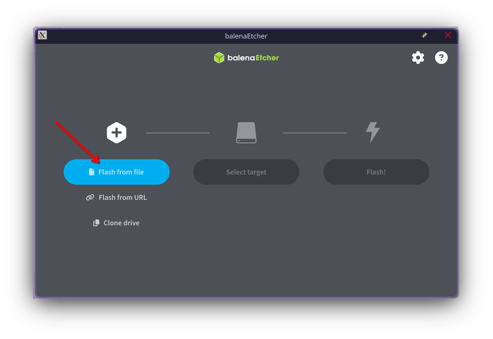
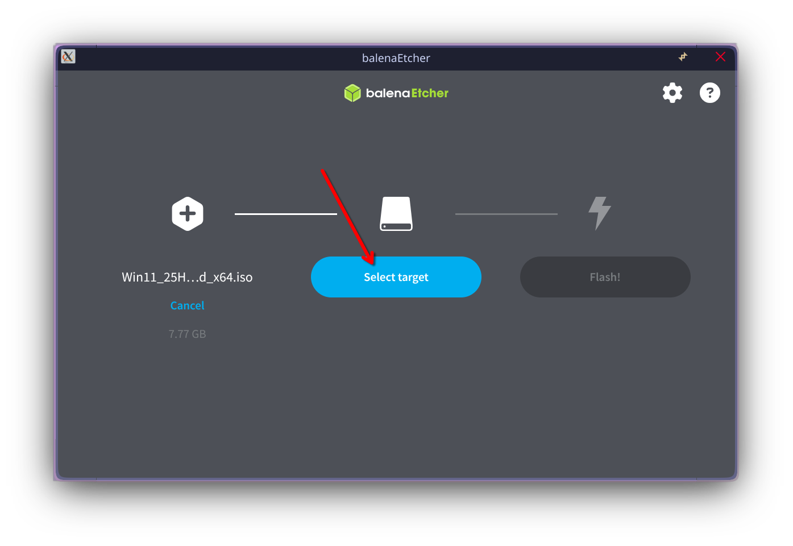
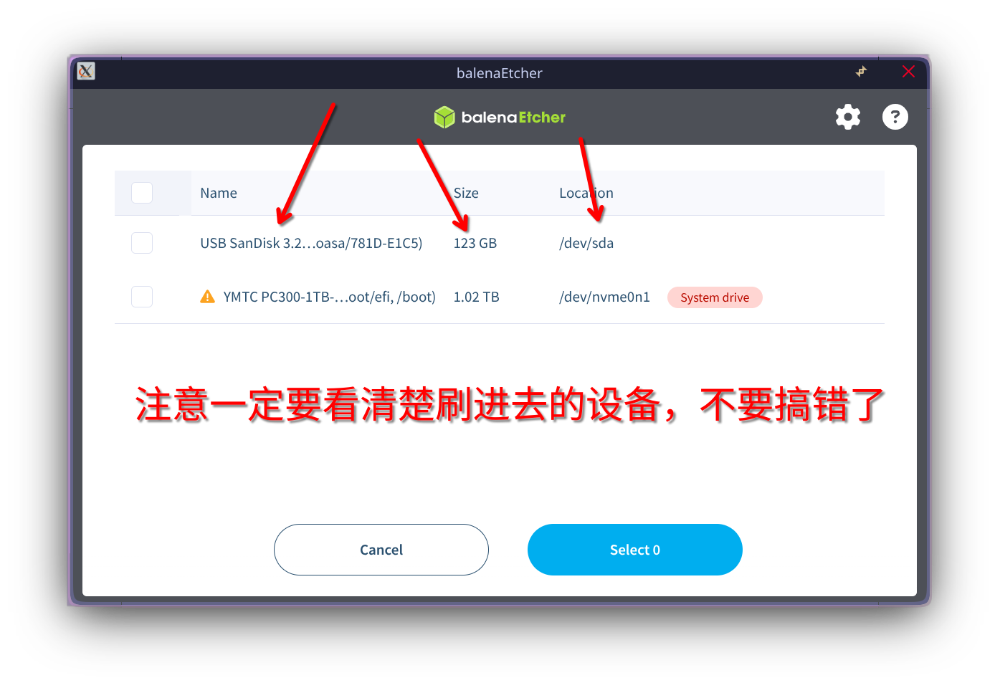
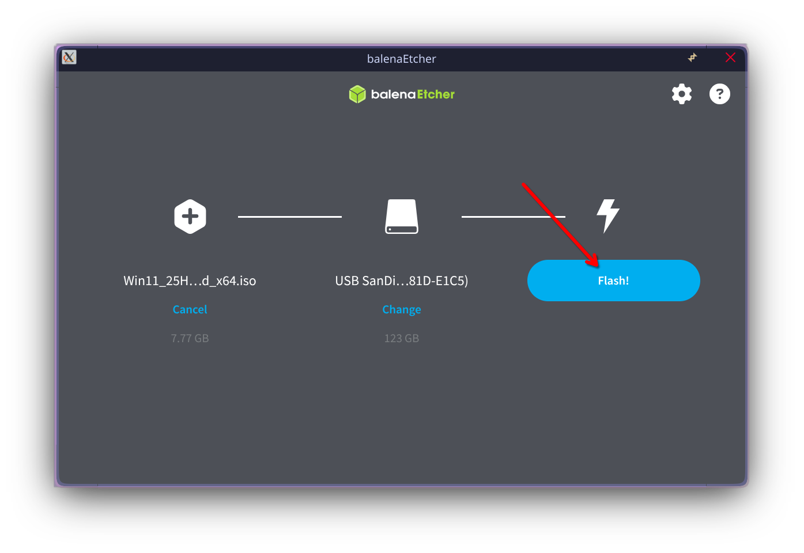
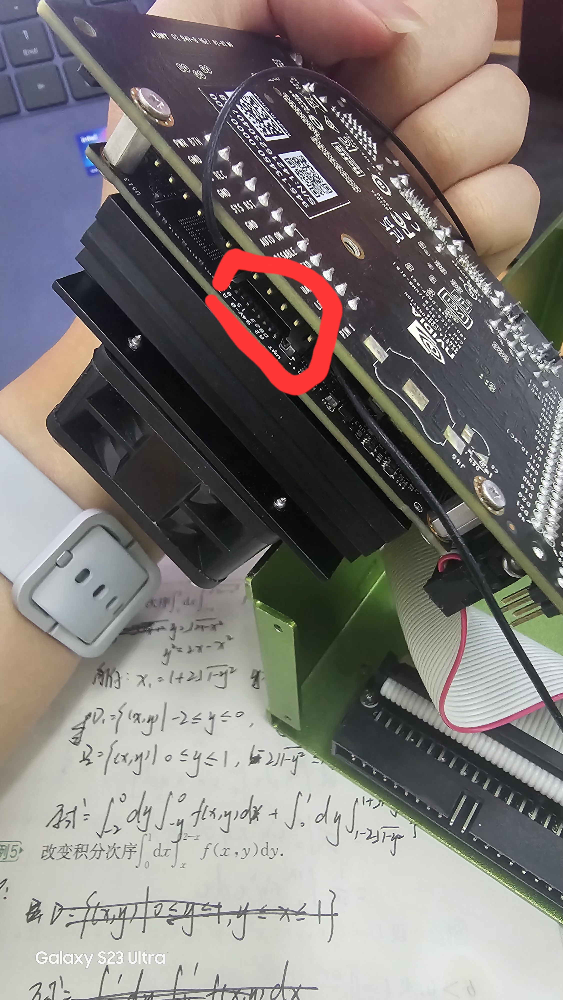
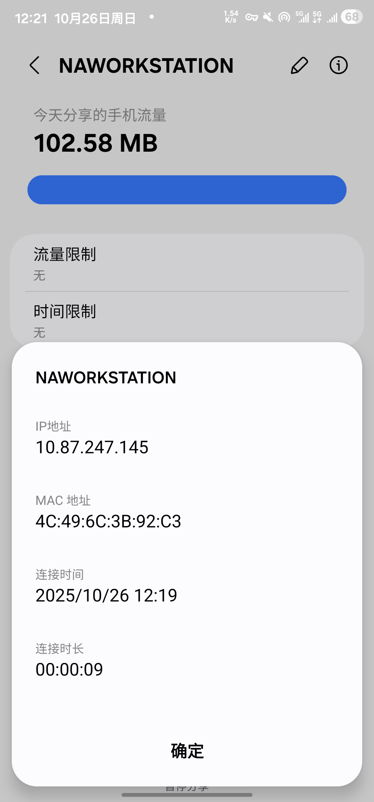

# 基于 NVIDIA Jetson Nano 的视觉开发的几点教程

> 首先，拿到 NVIDIA Jetson Nano 开发板后，请注意，在开发板裸机运行、无任何外壳保护措施的情况下，一定要小心不要将导体放在你的开发板附近，后果小则开发板触发保护断电，大则开发板烧毁
>
> 其次，当开发场景存在需要使用移动电源（UPS 模块）时，请务必慎重，22、23级师兄的开发板在网上购买使用这种 UPS 模块时，不是开发板烧了，就是 UPS 用没几次就坏了

## 1 安装系统

### 1.1 下载系统镜像

我们需要先下载系统镜像，可以直接烧录文档附带的 *jetson-nano-jp461-sd-card-image.zip* 文件，也可以直接从 [NVIDIA 官网下载](https://developer.nvidia.cn/jetson-nano-sd-card-image)

### 1.2 烧录系统

工欲善其事，必先利其器。我们需要烧录软件才能将系统镜像烧录到 sd 卡中，这里推荐 [balenaEthcer](https://etcher.balena.io/#download-etcher)

打开 balenaEtcher，点击 *Flash from file* ，选择镜像文件（可以直接选择 zip 文件，无需解压）



准备好读卡器，将 sd 卡接入电脑，然后我们点击 *Select Target* ，选择我们要烧录的 sd 卡**（这里一定要看清楚，小心不要选错设备，一旦开始烧录，你选择的设备里的所有数据都将被清空）**





最后，我们点击 *Flash!* ，等待烧录完成即可



烧录完成后，取下 sd 卡，将 sd 卡插入 Jetson Nano 的 sd 卡槽

sd 卡槽的位置如下：



## 2 初始化系统

找一块屏幕，还有一条 HDMI 线，用 HDMI 线将 Jetson Nano 和屏幕连接起来，将键盘鼠标连接到 Jetson Nano ，然后给 Jetson Nano 插上电源线，Jetson Nano 在通电的情况下自动开机

等待片刻后开机，我们可以看到这个界面

下面是初始化过程


这里选择**英语（美国）**键盘布局即可


请务必选择一个网络连接，最好是无线网络，后面有大作用


这里填写系统的用户名和密码，请一定要记住自己的**用户名**（圈出来**打勾**的，不是那个打岔的）和**密码**，忘记了很麻烦。还有也要记住这里的**计算机名**。这里一定要选择**自动登录**而不是登陆时需要密码，方便后续的开发部署


这里保持默认不要动


配置完成后，等待片刻，系统会重启


然后我们就进到系统桌面，至此系统初始化大功告成


## 小插曲1：摆脱 Jetson Nano 外接屏幕和键盘鼠标

完成初始化过后，我们就可以直接通过 SSH 来远程连接到 Jetson Nano ，而无需大费周章地外接屏幕和键盘鼠标

首先，我们先在自己的电脑（Windows 平台）安装 xshell 和 xftp ，这边建议下载[家庭/学校免费版](https://www.xshell.com/zh/free-for-home-school/)

还记得我们前面初始化的时候让大家务必连接到一个无线网络吗？Jetson Nano 开机时会自动连接到这个网络，我们将自己的电脑也连接到这个无线网络中，让 Jetson Nano 和我们的电脑处于同一个局域网下，然后我们打开无线网络的后台（这里只展示三星手机热点的情况，若是其他手机品牌，或者使用路由器的，**请具体情况具体分析**）查看 Jetson Nano 的计算机名对应的 IP 地址



打开 xshell ，点击新建


在这里填写刚才我们看到的 IP 地址


然后点击这里


在这里输入 Jetson Nano 系统中的用户名和密码


点击连接，我们就可以用命令行连接到 Jetson Nano 了


同理 xftp 也是这个方式连接


然后我们就可以轻松地在我们的电脑和 Jetson Nano 之间传输文件了


后续本教程将会使用 xshell 和 xftp 进行教学，不打算使用远程连接的同学可以使用 Jetson Nano 中的终端来执行后续教学中的命令


## 小插曲2：sd卡丢了？开发的时候不小心搞坏了环境？别担心，这里还有后悔药

### t1.1 备份

我们知道，Jetson Nano 的系统、还有你的所有的代码和项目文件全部保存在一张 sd 卡上，这张 sd 卡插到任何一台 Jetson Nano 上，都和你原来用的 Jetson Nano 别无二致。但是一旦 sd 卡丢失，或者脑子一抽一不小心把自己的代码或者项目文件破坏了，那可就倒大霉了。所以，学会备份是十分必要的。

首先，备份 sd 卡需要一台装有 Linux 任意发行版的机器（可以是虚拟机、实体机、树莓派甚至是另一台 Jetson Nano），Windows 和 wsl 比较麻烦，这里不建议使用。

我们将 sd 卡从原来的 Jetson Nano 取出，用读卡器接入上述所说的装有任意 Linux 发行版的机器，打开终端，这里我使用的是我的树莓派，我建议大家可以使用虚拟机，具体虚拟机如何安装、如何将读卡器接入到虚拟机里，大家可以在网上寻找教程，这里不过多赘述。

首先我们先安装一些依赖

* 假如用的是 Ubuntu/Debian 系 Linux

```bash
sudo apt install pv btop
```

* 假如用的是 Fedora/RHEL 等红帽系 Linux

```bash
sudo dnf install pv btop
```

* 假如用的是 Arch 系 Linux

```bash
sudo pacman -Sy pv btop
```

其他 Linux 发行版请自行查询资料如何安装pv和btop

然后在终端输入

```bash
lsblk
```


这里我们可以看到设备 sdc 大小为59.5G，接近 64 GB （我使用的是 64 GB 内存卡）而且有很多分区（sdc1、sdc2、......、sdc14），可以看出 sdc 就是我们的 sd 卡（不一定是 sdc ，需要自己判断是哪个设备）

我们看到 sdc1 分区最后一列有一个路径 `/media/pi/66181078-3393-4d65-bae1-8e21a4345b5`，说明这个分区被挂载了，备份前我们需要检查 sdc1、sdc2、......、sdc14 中是否有分区被挂载

我们输入以下命令

```bash
sudo umount /dev/sdc1
```

如果有其它分区被挂载，也是使用这个命令解除挂载

最后，我们检查一下 sdc 的所有分区是否都没有被挂载


确认完全解除挂载后，我们输入以下命令

```bash
sudo dd if=/dev/sdc bs=4M | pv -s $(sudo blockdev --getsize64 /dev/sdc) | xz -9 -T4 > jetson_nano_backup.img.xz
```

以下是命令的详细解释：

* sudo: 以root用户（即管理员）身份运行
* dd: Linux 中一种用于底层读写的工具
* if=/dev/sdc: if 表示的是 input file，即输入文件，/dev/sdc 就是我们的 sd 卡的设备文件，这里的 sdc 请具体情况具体分析，不一定都是这个
* bs=4M: 表示一次读取多少数据，保持4M即可
* | : 这个是管道符，表示将前一个命令的输出结果传递给下一个命令
* pv: Linux 上一个用于显示进度条的工具，没有这个工具是不会显示进度条的
* $(sudo blockdev --getsize64 /dev/sdc): 获取 sdc 这个设备的大小以方便创建进度条
* xz: Linux 上一个用于压缩文件的工具，相比其他压缩算法压缩效率更高，速度更慢
* -9: 压缩等级，取值1-9，等级越低速度越快，压缩效率越低，反之速度越慢，压缩效率越高
* -T4: 使用多少处理器线程进行压缩，这里用的是4线程，线程越高（不高于当前处理器线程数）速度越快，内存和CPU消耗越大，反之则速度越慢，内存和CPU消耗越小，拿不定主意可以将其改为-T0，速度比较慢，但至少可以保证不会卡死
* \>: 重定向符号，表示将前面的命令的输出内容写入到文件中
* jetson_nano_backup.img.xz: 这里填写你的备份文件的保存路径和文件名

----

这里我需要解释一下这条命令里的 xz 命令，大家可以在终端里输入`btop`并回车运行，此时会显示以下界面


我们可以看到左上角有 C0、C1、C2、C3 四个东西，说明我们的处理器一共4线程，我的建议是使用和你处理器相同的线程数进行压缩，假如压缩过程中内存消耗太大导致卡死或崩溃，可以将线程数调低，或者直接用-T0。当然我们还有一种选择，那就是不压缩进行备份，速度最快，但是备份文件占用的空间也是最大的，大小大约是和你的 sd 卡一样大的，也就是 sd 卡越大，备份出来的文件就越大，与你 sd 卡里具体存了多少东西无关

以下是不压缩备份的命令：

```bash
sudo dd if=/dev/sdc bs=4M | pv -s $(sudo blockdev --getsize64 /dev/sdc) > jetson_nano_backup.img
```

最后，我们就可以得到 *jetson_nano_backup.img.xz*（或*jetson_nano_backup.img*）这个文件，这个就是我们的备份文件，我们可以随时通过这个文件恢复到备份时的状态。

### t2.2 恢复

假如有一天真的不幸搞坏了环境，我们就可以搬出我们的备份文件来救急了

同样的，我们还是需要运行命令

```bash
lsblk
```

查看我们要恢复到哪一个设备中

然后同样的我们也要检查要恢复的设备的所有分区均没有被挂载，有被挂载的分区需要接触挂载，与上面备份的步骤相同，这里就不再赘述

然后执行以下命令恢复到设备中

有xz压缩的备份文件：

```bash
xz -dc jetson_nano_backup.img.xz | sudo dd of=/dev/sdc bs=4M status=progress
```

无压缩的备份文件

```bash
sudo dd if=jetson_nano_backup.img of=/dev/sdc bs=4M status=progress
```

注意，我们恢复出来的设备，容量一定要大于或等于原先我们备份的设备，比如 32GB 的 sd 卡备份可以恢复到 64GB sd卡上，64GB 的 sd 卡备份也可以恢复到 64GB sd卡上，但是 64GB 的 sd 卡备份是不可以恢复到 32GB sd卡上的。

当你将 32GB 的 sd 卡的备份文件恢复到 64GB sd卡上时，你会发现，你的 sd 卡只剩 32GB 可用空间，这该怎么办？

且听下文分解

### t2.3 小彩蛋

你可能会发现文档附带的文件中，除了 *jetson-nano-jp461-sd-card-image.zip* 这个官方系统镜像之外，最大的文件是 *nagatoasa_jetson_nano_backup.img.xz* 这个文件。这个是我留下的我的 Jetson Nano 备份，里面是完整已配置好环境，可以直接运行 OpenCV 和 YOLO 推理。

里面还有2025年电赛C题（视觉题，测距那一个）的项目文件和代码，可惜本人比较菜只拿了省三（悲）

当你因为后面配环境配到崩溃、心态爆炸的时候，不妨回头看看，或许这就是“踏破铁鞋无觅处，那人却在灯火阑珊处”

下面是这个系统的用户名和密码

> 用户名：nagatoasa
>
> 密码：12345678
>
> 计算机名：nagatoasa-desktop

这个备份文件是我在 32GB sd 卡上备份的，如果恢复到 64 GB sd 卡上时，可能会发现 sd 卡只有 32GB 可用空间，下面是解决办法

首先，我们先将恢复完成的 sd 卡插到 Jetson Nano 上并开机，打开终端，在终端中输入以下命令

```bash
sudo /usr/lib/nvidia/resizefs/nvresizefs.sh
```

现在，sd 卡就恢复到了原先 64 GB可用空间了，你可以通过`lsblk`命令查看效果

## 3 配置环境

现在，我们进入到这个教程的核心部分，感谢大家听完我前面的长篇大论（笑）

### 2.1 配置 Python 环境

首先，我们先安装几个系统依赖

```bash
sudo apt update
sudo apt install libopenblas-base libopenmpi-dev
sudo apt install libomp-dev
```

我们一般很少使用系统自带的 Python 环境，因为版本太老了，只有Python >= 3.8，才能够安装 ultralytics 包（用于 YOLO 推理），直接装Python 3.8缺少虚拟环境的话开发过程也不够灵活，anaconda 和 miniconda 也不支持 Jetson Nano ，这边推荐文档附带的 archiconda （*Archiconda3-0.2.3-Linux-aarch64.sh*），或者也可以去[官网下载](https://github.com/Archiconda/build-tools/releases/download/0.2.3/Archiconda3-0.2.3-Linux-aarch64.sh)

首先先给这个 sh 脚本提供可运行权限

```bash
chmod +x Archiconda3-0.2.3-Linux-aarch64.sh
```

然后运行脚本

```bash
./Archiconda3-0.2.3-Linux-aarch64.sh
```

这里直接按回车


这里输入`yes`后回车


这里保持默认回车即可


这里输入`yes`后回车


archiconda就安装完成啦

输入以下指令

```bash
source ~/.bashrc
```

然后输入以下指令

```bash
conda -V
```

输出以下结果就是安装成功了


----

接下来我们创建虚拟环境，输入以下指令

```bash
conda create -n vision python==3.8
```

这里的 vision 你可以替换成任何你记得住的名字，这个就是你的虚拟环境名

等待一段时间，可能比较久


输入`y`回车

等待下载安装完毕，我们的虚拟环境就安装成功了

当然假如你忘记了虚拟环境名的话可以运行以下指令，可以列出所有的虚拟环境

```bash
conda env list
```

这条命令可以删除对应的虚拟环境

```bash
conda env remove -n 虚拟环境名
```

----

下面我们来配置虚拟环境内的 Python 包

首先我们运行以下指令进入虚拟环境

```bash
conda activate vision
```

这里的 `vision` 跟据你设置的虚拟环境名来

运行以下命令升级一下pip

```bash
pip install --upgrade pip
```

然后运行以下命令

```bash
pip install numpy matplotliob --verbose
```

这里 `--verbose` 的意义是因为有些包需要编译或者其他操作比较消耗时间，为了区分卡死和正常安装，显示详细信息会比较好

然后我们找到文档附带的 *torch-1.11.0a0+gitbc2c6ed-cp38-cp38-linux_aarch64.whl* 和 *torchvision-0.12.0a0+9b5a3fe-cp38-cp38-linux_aarch64.whl*

运行以下命令

```bash
pip install ./torch-1.11.0a0+gitbc2c6ed-cp38-cp38-linux_aarch64.whl
pip install ./torchvision-0.12.0a0+9b5a3fe-cp38-cp38-linux_aarch64.whl
```

然后我们继续安装视觉项目的核心包

```bash
pip install opencv-python ultralytics --verbose
```

等待下载安装完成，时间比较长

这样，我们就完成了在 Jetson Nano 基础的视觉项目环境搭建

----

下面我们来配置 TensorRT

TensorRT 是通过对模型进行优化、降低精度，从而提高深度学习的推理速度，对于提高目标识别、图像分割等深度学习视觉算法的速度和实时性具有重要作用

首先安装一些 Python 包

```bash
pip install onnxslim onnx onnxruntime --verbose
```

然后我们找到文档附带的 *onnxruntime_gpu-1.6.0-cp38-cp38-linux_aarch64.whl* 和 *tensorrt-8.2.3.0-cp38-none-linux_aarch64.whl* 

运行以下指令

```bash
pip install ./onnxruntime_gpu-1.6.0-cp38-cp38-linux_aarch64.whl
pip install ./tensorrt-8.2.3.0-cp38-none-linux_aarch64.whl
```

这样我们就完成了TensorRT的配置
